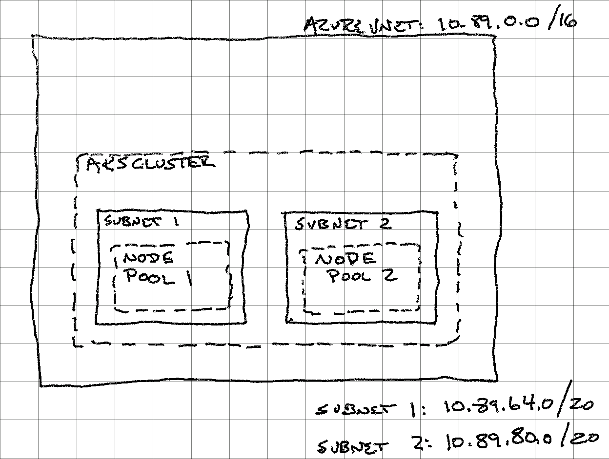

# AKS Cluster With Mixed Node Pools and An Existing VNET using AzureCNI

This example is a set of Terraform scripts that deploy a specific scenario where the AKS cluster is deployed within an existing virtual network and use [AzureCNI](https://docs.microsoft.com/en-us/azure/aks/configure-azure-cni) to allow deployed into the AKS cluster using IPs from the virtual network.  This is done with defining subnets within the virtual network with a range of IP addresses which nodes and pods deployed onto those notes will use when run in the cluster.  For this example, we also add one additional component - mixed node pools.  Specifically we deploy two node pools (in different subnets), one of which is Linux nodes and the second Windows nodes.

A scenario where this might be useful is one where, potentially, a number of worker nodes are needed for an application and other components within the system need to directly reach a pod without going through some sort of ingress controller.  For instance, the the distributed application was written for an infrastructure around virtual machines and migrating to one leveraging Kubernetes.

Azure CNI networking has an experimental feature for further refining the range of IPs that pods could be allocated.  It is referred to currently as [PodSubnetPreview](https://docs.microsoft.com/en-us/azure/aks/configure-azure-cni#dynamic-allocation-of-ips-and-enhanced-subnet-support-preview).  Given support for it is still in preview mode and only works with Linux VMs, it is not handled in this example.

One aspect of network planning that needs to be considered, with AzureCNI, is what size to create the VNET IP address space as well as the address spaces for each Subnet.  When using AzureCNI, each node and each pod gets an IP address allocated from the subnet address range.  By default, each node in AzureCNI has a minimum of 10 pods.  To allocate more, the `max_pods` value must be included in the Node Pool definition in the Terraform script.  For example, if you have 5 nodes and want to run 40 pods per node.  The subnet would need 5 + (5*40) or 205 allocatable IPs.  See [this](https://docs.microsoft.com/en-us/azure/aks/configure-azure-cni#maximum-pods-per-node) section of the documentation.

## Building Blocks

The building blocks within this example are:

- A Resource Group (this is created external to the Terraform deployment)
- A VNET within the Resource Group
- A Subnet for the Linux Node Pool
- A Subnet for the Windows Node Pool
- An AKS Cluster with AzureCNI defined
- Two Node Pools:
  - Linux Node Pool (deployed as part of the AKS definition)
  - Windows Node Pool (defined as a secondary Node Pool)
- Credentials for the Node Pools:
  - Username and SSH Public Key for Linux Nodes
  - Username and Password for Windows Nodes

Each of the logical components are broken into specific files.  While [main.tf](./main.tf) contains general setup items for the cluster, the other componets are:

- [network.tf](./network.tf) defines the network objects (vnet, subnets)
- [aks.tf](./aks/tf) defines the AKS components (cluster, node pools)
- [variables.tf](./variables.tf) outlines the variables that need to be defined to deploy the cluster

## Example Deployment



Based on the diagram above, the basic components of the deployment are outlined below:

| Resource | Explanation | Example Value |
| -------- | ----------- | ----- |
| Resource Group | A pre-existing resource group where resources are created | aksmxdcni |
| Virtual Network Address | A address range for VNET that will be created - 65536 IPs | 10.89.0.0/16 |
| Linux Node Pool Subnet Address | Address range for Linux Node Pool, within the VNET  - 4096 IPs | 10.89.64.0/20 |
| Windows Node Pool Subnet Address | Address range for the Windows Node Pool, within the VNET - 4096 IPs | 10.89.80.0/20 |
| Linux Node VM Size | SKU for VMs in the Linux Node Pool | Standard_DS2_v2 |
| Windows Node VM Size | SKU for VMs in the Windows Node Pool | Standard_DS3_v2 |

## Terraform Variables

The following table contains the Terraform variables required for deployment and the values used for deployment.

| Variable | Value |
| -------- | ----- |
| resource_group_name | aksmxdcni |
| base_name_prefix | mixedcni |
| vnet_address_space | 10.89.0.0/16 |
| subnet_1_address_space | 10.89.64.0/20 |
| subnet_2_address_space | 10.89.80.0/20 |
| aks_cluster_dns_prefix | mxdcni |
| default_node_pool_count | 3 |
| default_node_pool_vm_size | Standard_DS2_v2 |
| default_node_pool_name | mxdcnidef |
| default_node_pool_max_pods | 20 |
| linux_node_ssh_key | `ssh key info` |
| linux_node_username | mxdcni |
| win_pool_vm_size | Standard_DS3_v2 |
| win_pool_count | 2 |
| win_pool_max_pods | 20 |
| windows_admin_name | mxdadmin |
| windows_admin_password | `password` |

## Deploying Terraform

In order to deploy the cluster:

1. Checkout the Terraform scripts
2. Create the terraform.tfvars file, say `/tmp/terraform.tfvars`
3. `terraform init`
4. `terraform apply -var-file=/tmp/terraform.tfvars` and answer `yes` when asked to do the deployment.

Once the cluster is deployed, one can get the credentials and interact with the cluster as follows:

- `az aks get-credentials --resource-group "aksmxdcni" --name "mixedcni-djdodx-aks"`
- `kubectl get nodes`

Which will result in the following:

```bash
$ kubectl get nodes
NAME                              STATUS   ROLES   AGE     VERSION
aks-defpool-20406575-vmss000000   Ready    agent   12m     v1.21.7
aks-defpool-20406575-vmss000001   Ready    agent   12m     v1.21.7
aks-defpool-20406575-vmss000002   Ready    agent   12m     v1.21.7
akswinpl1000000                   Ready    agent   8m55s   v1.21.7
akswinpl1000001                   Ready    agent   8m52s   v1.21.7
```